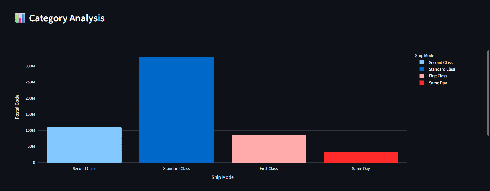
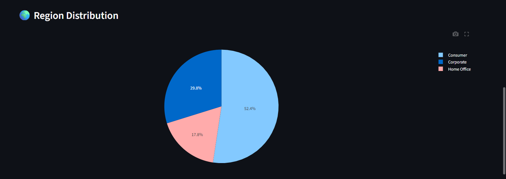
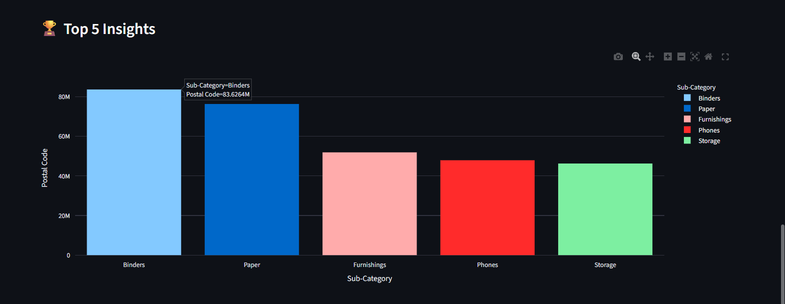
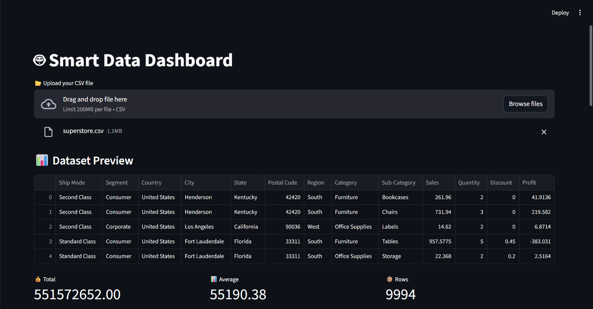
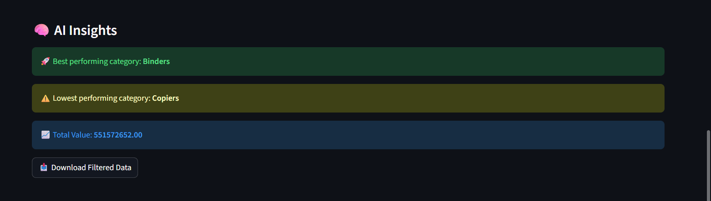

# 🚀 Dynamic Data Dashboard

A smart and interactive data dashboard built using **Python, Streamlit, and Plotly** that allows users to upload any dataset and generate insights instantly.

---

## 📊 Features

- 📂 Upload any CSV dataset  
- 🤖 Auto-detect column types  
- 🎛️ Dynamic filters  
- 📈 Interactive charts (bar, pie)  
- 🧠 Smart AI-like insights  
- 📥 Download filtered data  
- ⚡ Fast and user-friendly interface  

---

## 🛠️ Tech Stack

- Python  
- Pandas  
- Streamlit  
- Plotly  

---

## 💡 Use Cases

- Business data analysis  
- Sales performance tracking  
- Data visualization  
- Academic projects  

---

## 🌐 Live Demo

([Click Here For Live Demo](https://dynamic-data-dashboard-bbiambzetswd8hrkdhhpnn.streamlit.app/))

---

## 📷 Screenshots

### 📊 Category-analysis


### 📈 Pie Chart


### 🏆 Top 5 Insights


### 📂 Upload CSV Feature


### 🧠 AI Insights


---

## 📌 How to Run Locally

```bash
pip install -r requirements.txt
streamlit run app.py
